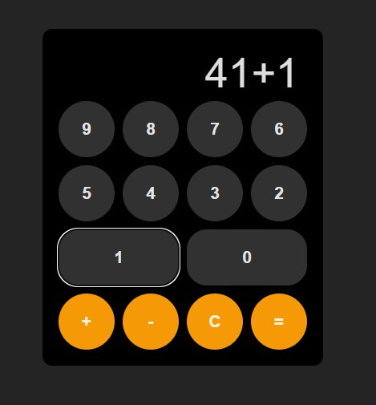

# Homework Components 3



## Описание

Этот репозиторий содержит небольшое приложение **Калькулятор** с базовыми функциями:
- Сложение и вычитание чисел.
- Изменение цвета результата в зависимости от значения.
- Функция очистки поля ввода.

Приложение разработано на базе React и предназначено для демонстрации работы с компонентами и состоянием.

## Использование

Приложение доступно по следующей ссылке на GitHub Pages:

[Homework Components 3 - GitHub Pages](https://blinklay.github.io/homework-components-3/)

### Функциональность
- **Сложение и вычитание**: Введите числа и выберите соответствующую операцию.
- **Изменение цвета результата**: Результат автоматически меняет цвет в зависимости от своего значения (положительное, отрицательное или ноль).
- **Очистка поля ввода**: Кнопка "Очистить" удаляет введенные значения и сбрасывает результат.

## Скриншот


## Установка и запуск

Для локального запуска приложения выполните следующие шаги:

1. Клонируйте репозиторий:

    ```bash
    git clone https://github.com/blinklay/homework-components-3.git
    ```

2. Перейдите в директорию проекта:

    ```bash
    cd homework-components-3
    ```

3. Установите зависимости:

    ```bash
    npm install
    ```

4. Запустите приложение:

    ```bash
    npm start
    ```

После этого приложение будет доступно по адресу `http://localhost:3000`.

